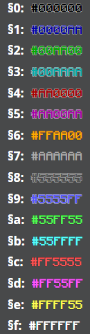
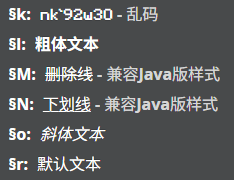

# ⭐ Minecraft 格式化代码渲染器 (Minecraft Formatting Code Renderer)

[](https://github.com/Spectrollay/minecraft_formatting_code_online/stargazers) [](https://github.com/Spectrollay/minecraft_formatting_code_online/network/members) [](LICENSE) [](https://spectrollay.github.io/minecraft_formatting_code_online/)

🎉 **一个能完美再现 Minecraft § 格式化代码样式的前端渲染器！** 无论你是想在网页中展示带有 Minecraft 特色的文本，还是为你的项目增添一些像素风采，本工具都能轻松实现。

**在线体验 & 实时编辑:** [点击访问](https://spectrollay.github.io/minecraft_formatting_code_online/)

> ⚠️ 本项目遵循 [MIT 协议](LICENSE) 开放源代码。任何修改和再发布行为都必须保留原始的著作权声明和许可声明。
>
> 📢 项目在线地址应用了 [OreUI](https://github.com/Spectrollay/OreUI) 技术，使用即代表你已阅读并同意对应的使用条款与免责声明。

---

## ✨ 项目特性

* **高度还原**: 精确渲染 Minecraft 中的颜色代码和样式代码。
* **纯粹前端**: 无需后端依赖，纯 HTML, CSS 和 JavaScript 实现。
* **轻量易用**: 引入简单，设计直观，确保在通俗易懂的前提下即写即用。
* **多种渲染**: 支持通过 CSS 类名自动渲染，或通过 JavaScript 函数动态渲染。
* **在线编辑**: 提供便捷的在线工具，即时预览渲染效果。

## 📸 效果演示





## 🚀 开始使用

你可以通过以下两种方式使用本项目：

### 1. 🌐 在线体验

最简单快捷的方式！直接访问我们的在线渲染页面：
https://spectrollay.github.io/minecraft_formatting_code_online/

按照页面内的指引操作，即可体验文本渲染效果。

### 2. 💻 本地集成 (开发者)

如果你希望将此功能集成到你自己的网页项目中，请按以下步骤操作：

#### 步骤 1: 下载必要文件

将以下核心文件下载到你的项目中：

* `mcfc.css` (样式表)
* `mcfc.js` (JavaScript 逻辑)
* `Minecraft-Seven.otf` (字体文件，需要确保 CSS 中路径引用正确，或根据你的项目结构调整 `mcfc.css` 内的 `@font-face` 路径)

建议将它们放置在项目的某个资源文件夹下，例如 `assets/minecraft-renderer/`。

#### 步骤 2: 在 HTML 中引入文件

在你的 HTML 文件 `<head>` 部分引入 CSS 文件，并在 `<body>` 底部（或 `<head>` 中使用 `defer` 属性）引入 JavaScript 文件：

```html
<head>
    <meta charset="UTF-8">
    <meta name="viewport" content="width=device-width, initial-scale=1.0">
    <title>我的网页</title>
    <link rel="stylesheet" href="path/to/your/mcfc.css">
</head>
<body>
    <div class="mcfc">§e这是§c一段§b示例§d文字！</div>

    <script src="path/to/your/mcfc.js"></script>
    </body>
</html>
````

#### 步骤 3: 使用渲染功能

你有两种方式来渲染包含 Minecraft 格式化代码的文本：

##### 方法 A: 使用 CSS 类名 `mcfc`

为任何包含 Minecraft 格式化代码的 HTML 元素添加 `mcfc` 类名。脚本会自动查找并渲染这些元素内的文本。

```html
<p class="mcfc">§a这是通过 Class 类名渲染的文本, §l§n包含粗体和下划线§r。</p>
<div class="mcfc">§1§l服务器名称§r§f - §7欢迎来到我们的服务器！</div>
```

*注意：对于没有 `§` 符号包含的文字，仅会更改字体为 Minecraft Seven，不会更改样式。*

##### 方法 B: 调用 JavaScript 函数 `renderAllMinecraftText()`

如果你需要动态加载内容或在特定时机触发渲染，可以调用全局函数 `renderAllMinecraftText()`。此函数会重新扫描并渲染所有带有 `mcfc` 类名的元素，或者你可以配合它更精细地控制特定元素的渲染。

以下示例展示了如何从输入框获取文本，并在指定区域进行渲染：

```html
<div>
    <label for="mc_input">输入 Minecraft 格式化代码:</label>
    <input type="text" id="mc_input" value="§eHello §cWorld!">
    <button onclick="renderMyText()">渲染</button>
</div>
<div id="render_output_area"></div>

<script>
function renderMyText() {
    const inputText = document.getElementById('mc_input').value;
    const renderArea = document.getElementById('render_output_area');

    // 清空之前的渲染结果
    renderArea.innerHTML = '';

    if (!/\S/.test(inputText)) { // 简单检查是否为空
        const hint = document.createElement('span');
        hint.style.color = 'gray'; // 简单提示样式
        hint.textContent = '请输入格式化代码后再渲染!';
        renderArea.appendChild(hint);
        return;
    }

    // 创建一个容器用于渲染
    const spanToRender = document.createElement('span');
    spanToRender.className = 'mcfc'; // 必须要有这个类名，或者确保JS逻辑能找到它
    spanToRender.dataset.rawText = inputText; // 存储原始文本（可选，但有时有用）
    spanToRender.textContent = inputText; // 设置§代码文本

    renderArea.appendChild(spanToRender);

    // 调用全局渲染函数
    renderAllMinecraftText();
}
</script>
```

*你可以根据需求更改 `mcfc.js` 中 `renderAllMinecraftText()` 的具体实现逻辑并调整上述 JS 示例。*

## 🤝 参与贡献

我们欢迎各种形式的贡献！无论是提交 Issue、提出新功能建议，还是直接贡献代码 (Pull Request)，都将帮助本项目变得更好。

1.  Fork 本仓库
2.  创建你的分支 (`git checkout -b feature/AmazingFeature`)
3.  提交你的修改 (`git commit -m 'Add some AmazingFeature'`)
4.  推送到分支 (`git push origin feature/AmazingFeature`)
5.  打开一个 Pull Request

## 📜 许可证

本项目基于 [MIT 协议](LICENSE) 授权。你可以自由使用、修改和分发，但务必保留原始许可声明。

## 📬 联系我们

如果你有任何问题、建议或想要交流，可以通过以下方式联系我们：

[](https://t.me/Spectrollay_MCW)   [](https://qm.qq.com/q/AqLmKLH9mM)   [](https://yhfx.jwznb.com/share?key=VyTE7W7sLwRl&ts=1684642802)
